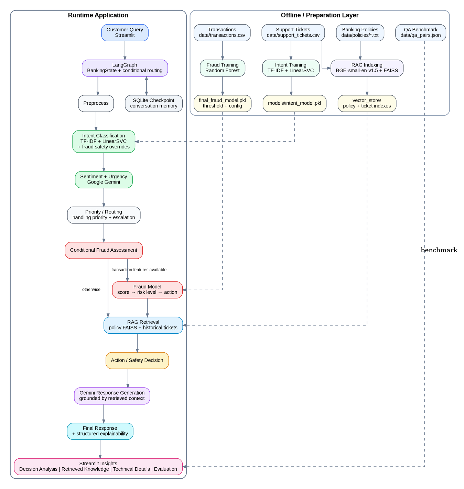

# AI-Powered Banking Support & Fraud Intelligence System

An end-to-end banking support application that combines **NLP, machine learning, RAG, LangGraph, FAISS, Google Gemini, SQLite, and Streamlit** to classify customer queries, assess transaction risk, retrieve relevant banking policies and historical cases, and generate context-aware responses.

The project is designed as a portfolio-grade example of how traditional ML models and LLM-based components can be orchestrated in a production-style workflow.



## Project Overview

Banking support queries often require more than a generic chatbot response. A useful system needs to understand the customer's intent, detect urgency and sentiment, apply specialized fraud logic when transaction details are available, retrieve authoritative policy information, and maintain conversation context.

This project addresses that workflow through a **stateful LangGraph pipeline**:

**Customer Query → Intent & Sentiment Analysis → Conditional Routing → Fraud Assessment (when applicable) → RAG Retrieval → Action Recommendation → Gemini Response → Explainability**

For fraud-related support queries where transaction-level features are not available, the system does **not** invent transaction features. The fraud model is skipped and the query continues through the support/RAG path.

## Key Features

- **Intent Classification** using TF-IDF features and a Linear SVM (`LinearSVC`)
- **Fraud Detection** using a trained Random Forest model with a configurable probability threshold
- **Fraud Safety Override Rules** for high-signal phrases such as unauthorized transactions and OTP-related fraud
- **Sentiment and Urgency Analysis** using Google Gemini
- **RAG with FAISS** using BGE-small-en-v1.5 embeddings
- **Policy-Aware Retrieval** for fraud, KYC, loan, refund/dispute, and account-access queries
- **Historical Ticket Retrieval** to provide additional support context
- **LangGraph Orchestration** with conditional routing and typed state management
- **SQLite Conversation Memory** through LangGraph checkpointing
- **Streamlit UI** with chat, decision analysis, retrieved knowledge, technical details, and evaluation metrics
- **Structured Explainability** showing graph path, routing information, fraud result, retrieved documents, and decision metadata without exposing hidden chain-of-thought
- **Evaluation Notebooks** for data validation, intent modeling, fraud modeling, RAG, end-to-end graph validation, and response/retrieval evaluation

## Technology Stack

| Layer | Technology |
|---|---|
| Language | Python |
| Data / EDA | Pandas, NumPy, Matplotlib |
| Intent Model | scikit-learn, TF-IDF, LinearSVC |
| Fraud Model | scikit-learn Random Forest |
| Embeddings | Sentence Transformers, `BAAI/bge-small-en-v1.5` |
| Vector Search | FAISS CPU |
| Orchestration | LangGraph |
| LLM | Google Gemini via `google-genai` |
| Memory | SQLite + `langgraph-checkpoint-sqlite` |
| UI | Streamlit |
| Notebook Environment | Jupyter / IPython kernel |

## System Architecture

The system has two broad parts:

1. **Knowledge / model preparation**: source data is cleaned, models are trained, documents are embedded, and FAISS indexes are built.
2. **Runtime support flow**: Streamlit sends a customer query into LangGraph, which performs classification, conditional fraud analysis, retrieval, action selection, and response generation.

### Runtime flow

```text
Customer Query
      |
      v
Streamlit Chat Interface
      |
      v
LangGraph State
      |
      +--> Preprocess
      |
      +--> Intent Classification (TF-IDF + Linear SVM)
      |
      +--> Sentiment / Urgency (Gemini)
      |
      +--> Priority & Routing
      |        |
      |        +---- Fraud query + transaction features ----> Fraud Model
      |        |                                                |
      |        |                                                v
      |        |                                           Risk / Score
      |        |
      |        +---- Other / incomplete transaction data ------+
      |
      +--> RAG Retriever
      |       |
      |       +--> Policy FAISS Store
      |       +--> Historical Ticket FAISS Store
      |
      +--> Action / Escalation Decision
      |
      +--> Gemini Response Generation
      |
      +--> Structured Explainability
      |
      +--> SQLite Checkpoint / Conversation Memory
```

## LangGraph Routing Logic

The graph uses conditional routing so the fraud model is invoked only when the query and transaction data support a meaningful fraud assessment.

### Example: fraud query with transaction data

```text
preprocess
   ↓
intent
   ↓
sentiment
   ↓
priority
   ↓
fraud
   ↓
rag
   ↓
action
   ↓
llm
```

### Example: fraud/support query without transaction data

```text
preprocess
   ↓
intent
   ↓
sentiment
   ↓
priority
   ↓
rag
   ↓
action
   ↓
llm
```

The second path intentionally avoids fabricating `amount_inr`, `hour_of_day`, or `day_of_week` values.

## Machine Learning Components

### 1. Intent Classification

The intent model classifies customer messages into banking support categories such as:

- `Fraud/Unauthorized`
- `KYC`
- `Loan`
- `Account Access`

The notebook uses **word + character TF-IDF features** with a **Linear SVM (`LinearSVC`)** classifier.

The runtime intent module also contains safety-oriented phrase overrides. This prevents certain strong fraud indicators from being lost when the statistical classifier produces a different class.

Model artifact:

```text
models/intent_model.pkl
```

### 2. Fraud Detection

The fraud model is a Random Forest classifier trained on transaction-behaviour features. The runtime fraud scoring uses:

- `amount_inr`
- `hour_of_day`
- `day_of_week`

The project uses a configurable fraud probability threshold of **0.60** and risk bands around **0.30** and **0.60** for translating model probability into business-facing risk levels/actions.

Model artifacts:

```text
models/final_fraud_model.pkl
models/fraud_threshold.pkl
models/fraud_config.pkl
```

### 3. Sentiment and Urgency

Google Gemini is used to determine customer sentiment and urgency and to generate the final natural-language response.

The application keeps the LLM responsible for language understanding/generation while deterministic and ML components handle important routing and fraud decisions.

## Retrieval-Augmented Generation (RAG)

The RAG pipeline combines authoritative banking policies with historical support tickets.

### Policy documents

```text
data/policies/
├── account_access_policy.txt
├── fraud_handling_policy.txt
├── kyc_policy.txt
├── loan_processing_policy.txt
└── refund_dispute_policy.txt
```

These documents are embedded with **BGE-small-en-v1.5** and indexed with FAISS.

### Vector stores

```text
vector_store/
├── policy.index
├── policy_metadata.pkl
├── support_tickets.index
└── support_ticket_metadata.pkl
```

The runtime retriever uses the detected intent to focus policy retrieval on relevant documents while also retrieving historical support context.

## Evaluation

The project includes separate evaluation for retrieval quality and generated-response semantic similarity.

### Retrieval evaluation

Latest recorded retrieval benchmark for policy-covered QA cases:

| Metric | Result |
|---|---:|
| Hit@1 | **94.12%** |
| Hit@3 | **100.00%** |
| MRR | **0.9706** |
| Mean Top-1 Similarity | **0.6984** |
| Mean Relevant Similarity | **0.6967** |

### Response evaluation

The response evaluator compares generated answers with the reference answers in the QA benchmark using embedding-based semantic similarity.

Latest recorded aggregate results after improving Account Access retrieval/grounding:

| Metric | Result |
|---|---:|
| Mean semantic similarity | **~0.81** |
| Median semantic similarity | **~0.84** |
| Reference-match rate (similarity ≥ 0.75) | **~65%** |

**Important:** semantic similarity is an evaluation signal, not a claim of factual accuracy. Response quality also depends on grounding, policy correctness, and the individual query.

Evaluation artifacts:

```text
data/retrieval_evaluation_results.csv
data/response_evaluation_results.csv
```

The generated Gemini response cache used during evaluation is intentionally excluded from Git because it is a runtime/evaluation artifact.

## Dataset Overview

The project uses three main datasets:

### Support tickets

```text
data/support_tickets.csv
```

The dataset covers banking support categories including Account Access, Fraud/Unauthorized, KYC, and Loan, with fields related to sentiment, risk, resolution time, customer satisfaction, and escalation.

### Transactions

```text
data/transactions.csv
```

Transaction-level records are used for fraud model development and runtime fraud scoring when the required transaction features are available.

### QA benchmark

```text
data/qa_pairs.json
```

The QA pairs are used as a **validation and evaluation benchmark**, rather than as the primary production knowledge source.

## Streamlit Application

The Streamlit application provides:

- Customer chat interface
- Optional transaction inputs for fraud assessment
- Conversation history / thread handling
- Decision Analysis
- Retrieved Knowledge
- Technical Details
- Evaluation metrics

The UI is designed to make the system's structured decision process visible, including the graph path and retrieved evidence.

Run the application with:

```bash
streamlit run app/streamlit_app.py
```

## Project Structure

```text
AI-Powered-Banking-Support-Fraud-Intelligence-System/
│
├── app/
│   └── streamlit_app.py
│
├── data/
│   ├── policies/
│   │   ├── account_access_policy.txt
│   │   ├── fraud_handling_policy.txt
│   │   ├── kyc_policy.txt
│   │   ├── loan_processing_policy.txt
│   │   └── refund_dispute_policy.txt
│   ├── qa_pairs.json
│   ├── response_evaluation_results.csv
│   ├── retrieval_evaluation_results.csv
│   ├── support_tickets.csv
│   └── transactions.csv
│
├── models/
│   ├── final_fraud_model.pkl
│   ├── fraud_config.pkl
│   ├── fraud_threshold.pkl
│   └── intent_model.pkl
│
├── notebooks/
│   ├── data_validation_eda.ipynb
│   ├── intent_modeling.ipynb
│   ├── fraud_modeling.ipynb
│   ├── rag_pipeline.ipynb
│   ├── evaluation.ipynb
│   └── graph_validation.ipynb
│
├── src/
│   ├── evaluation/
│   │   └── evaluator.py
│   ├── graph/
│   │   ├── banking_graph.py
│   │   └── state.py
│   ├── llm/
│   │   └── gemini.py
│   ├── ml/
│   │   ├── fraud.py
│   │   └── intent.py
│   └── rag/
│       └── retriever.py
│
├── vector_store/
│   ├── policy.index
│   ├── policy_metadata.pkl
│   ├── support_tickets.index
│   └── support_ticket_metadata.pkl
│
├── .env.example
├── .gitignore
├── requirements.txt
└── requirements-freeze.txt
```

## Getting Started

### 1. Clone the repository

```bash
git clone <YOUR_GITHUB_REPOSITORY_URL>
cd AI-Powered-Banking-Support-Fraud-Intelligence-System
```

### 2. Create and activate a virtual environment

Windows:

```bash
python -m venv venv
venv\Scripts\activate
```

Linux/macOS:

```bash
python -m venv venv
source venv/bin/activate
```

### 3. Install dependencies

```bash
python -m pip install -r requirements.txt
```

### 4. Configure Gemini

Create a local `.env` file from `.env.example`:

```text
GEMINI_API_KEY=your_gemini_api_key_here
```

Never commit your real `.env` file or API key.

### 5. Run Streamlit

```bash
streamlit run app/streamlit_app.py
```

## Running the Notebooks

The notebooks are organized so data preparation, model development, RAG construction, evaluation, and graph validation are separated.

| Notebook | Purpose |
|---|---|
| `data_validation_eda.ipynb` | Data quality checks and exploratory analysis |
| `intent_modeling.ipynb` | Intent model training, validation, and artifact saving |
| `fraud_modeling.ipynb` | Fraud model training, threshold/risk configuration, and artifact saving |
| `rag_pipeline.ipynb` | Document chunking, embeddings, FAISS indexes, and retrieval tests |
| `evaluation.ipynb` | Retrieval and cached response evaluation |
| `graph_validation.ipynb` | End-to-end LangGraph and SQLite memory validation |

## Configuration and Files That Stay Local

The repository `.gitignore` excludes sensitive and runtime-only files such as:

```text
.env
.streamlit/secrets.toml
models/*.sqlite
models/*.sqlite-shm
models/*.sqlite-wal
data/evaluation_generated_responses.json
```

The trained model artifacts and FAISS vector stores are kept in the repository because they are required to run the application without retraining/re-indexing from scratch.

## Design Principles

### Separation of responsibilities

Traditional ML models handle structured classification and fraud scoring, FAISS handles retrieval, LangGraph handles orchestration/state transitions, and Gemini handles language-level reasoning and response generation.

### Grounded responses

The final response is generated using retrieved banking knowledge rather than relying only on model memory.

### Safe handling of missing transaction data

The fraud model is not run when the transaction-level inputs required by the model are unavailable.

### Explainability without exposing hidden reasoning

The application displays structured decision metadata such as intent, routing reason, fraud score/risk, retrieved documents, and graph path. It does not expose private chain-of-thought.

## Known Limitations

- Fraud scoring depends on the availability and quality of transaction-level features.
- Generated language is still dependent on the LLM and should be validated against authoritative policy in real banking deployments.
- Embedding similarity is useful for benchmarking retrieval/response alignment but should not be treated as a standalone measure of factual correctness.
- The project is a portfolio/educational system and is **not intended for direct production use in a regulated banking environment** without additional security, compliance, monitoring, audit, and human-review controls.

## Future Enhancements

Potential next steps include:

- Better transaction/entity extraction for richer fraud assessments
- More sophisticated reranking of retrieved documents
- Human-in-the-loop escalation workflows
- Persistent production-grade conversation storage
- Automated feedback-driven retraining
- API deployment and authentication
- Test automation and CI/CD
- Monitoring for model drift and retrieval quality

## License

This project is intended as a portfolio/learning project. Add the repository license that matches how you plan to share or reuse the code.

## Author

Add your name, LinkedIn, GitHub, and portfolio links here.
